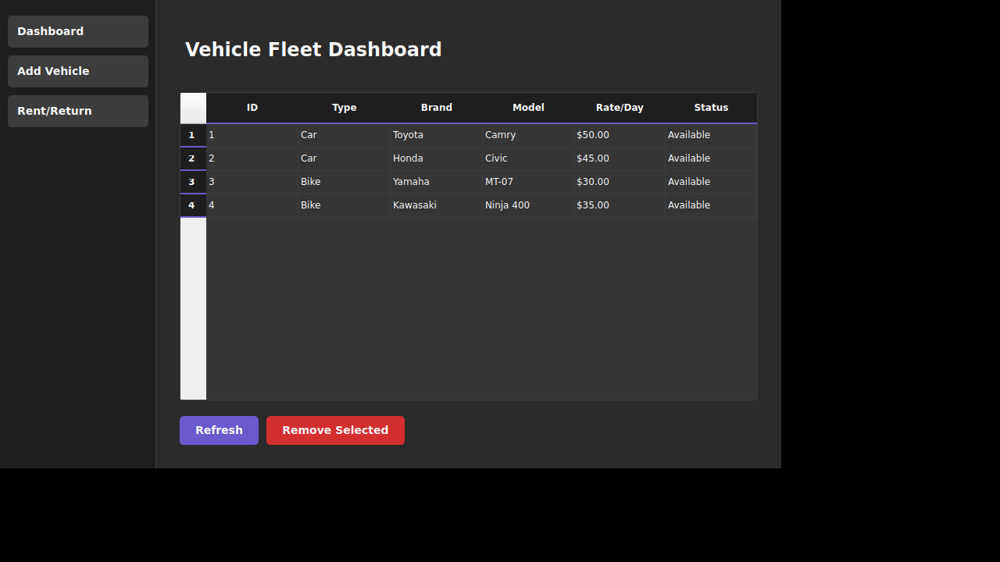
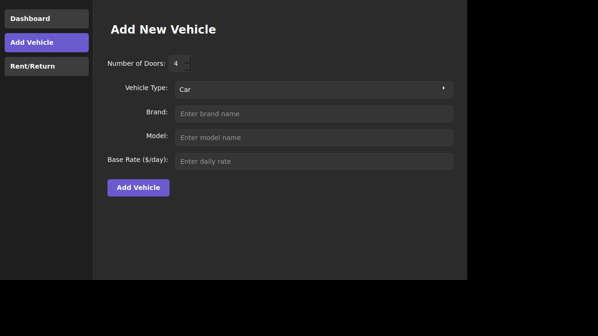
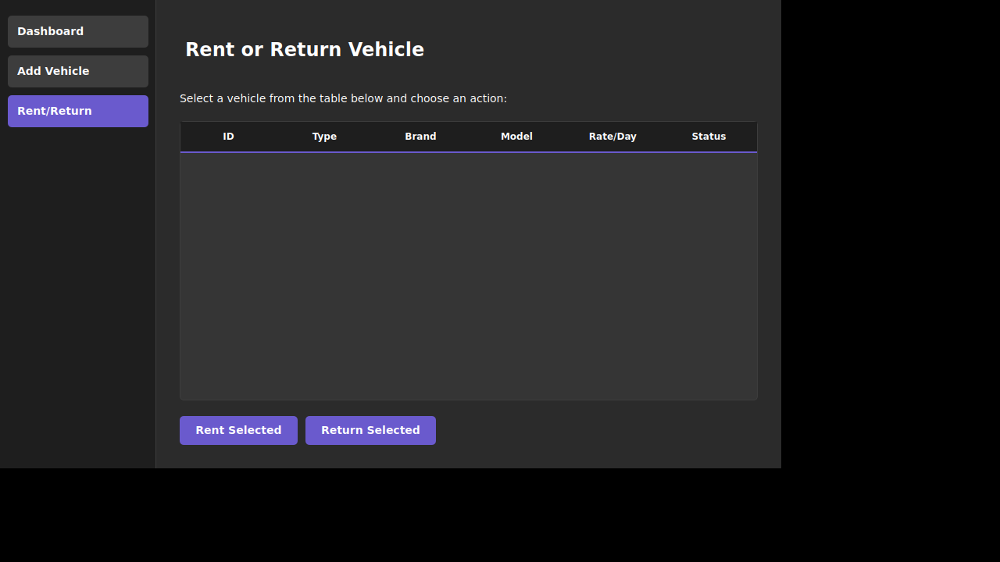

# Vehicle Rental System - GUI Showcase

This document showcases the graphical user interface (GUI) of the Vehicle Rental System application.

## Overview

The Vehicle Rental System features a modern, dark-themed Qt6 GUI with three main views accessible through a sidebar navigation:

1. **Dashboard** - View and manage the vehicle fleet
2. **Add Vehicle** - Add new vehicles to the system
3. **Rent/Return** - Rent out or return vehicles

## Design Features

- **Dark Theme**: Professional dark color scheme with purple accent colors
- **Sidebar Navigation**: Easy access to all main features
- **Responsive Tables**: Dynamic vehicle fleet display with sorting capabilities
- **Form Validation**: Input validation for adding vehicles
- **Interactive Buttons**: Hover effects and clear visual feedback

---

## 1. Dashboard View

The Dashboard is the main view that displays the entire vehicle fleet in a table format.



### Features:
- **Vehicle Table**: Shows all vehicles with columns for:
  - ID: Unique vehicle identifier
  - Type: Car or Bike
  - Brand: Vehicle manufacturer
  - Model: Vehicle model name
  - Rate/Day: Daily rental rate in dollars
  - Status: Available or Rented
- **Refresh Button**: Updates the table with current fleet data
- **Remove Selected Button**: Removes the selected vehicle from the fleet
- **Sample Data**: Comes pre-loaded with 4 sample vehicles (2 cars, 2 bikes)

---

## 2. Add Vehicle Form

The Add Vehicle form allows users to add new cars or bikes to the rental fleet.



### Features:
- **Vehicle Type Selector**: Choose between Car or Bike
- **Brand Input**: Enter the vehicle manufacturer
- **Model Input**: Enter the vehicle model
- **Base Rate Input**: Set the daily rental rate
- **Type-Specific Fields**:
  - **For Cars**: Number of Doors selector (2-5 doors)
  - **For Bikes**: Engine Capacity input (50-2000 cc)
- **Add Vehicle Button**: Submits the form and adds the vehicle
- **Input Validation**: Ensures all fields are properly filled
- **Form Reset**: Clears inputs after successful submission

---

## 3. Rent/Return Interface

The Rent/Return view allows users to manage vehicle rental operations.



### Features:
- **Vehicle Selection Table**: Displays all vehicles with their current status
- **Rent Selected Button**: Marks an available vehicle as rented
- **Return Selected Button**: Returns a rented vehicle to available status
- **Status Updates**: Real-time updates of vehicle rental status
- **Selection Validation**: Prevents invalid operations (e.g., renting already-rented vehicles)
- **Confirmation Messages**: Success/error dialogs for all operations

---

## Technical Details

### UI Framework
- **Qt6 Widgets**: Modern C++ GUI framework
- **Custom QSS Styling**: CSS-like stylesheets for consistent theming
- **QStackedWidget**: Manages multiple view navigation
- **QTableWidget**: Dynamic table display with sorting

### Color Scheme
- **Background**: Dark gray (#2b2b2b)
- **Sidebar**: Darker gray (#1e1e1e)
- **Accent Color**: Slate purple (#6a5acd)
- **Text**: White (#ffffff)
- **Borders**: Medium gray (#3d3d3d)

### Interactive Elements
- **Hover Effects**: Buttons lighten on hover
- **Focus Indicators**: Purple borders on focused inputs
- **Selection Highlighting**: Purple background for selected table rows
- **Rounded Corners**: 5px radius on all interactive elements

---

## Building and Running

To see the GUI in action, follow these steps:

```bash
# Install dependencies (Ubuntu/Debian)
sudo apt-get install qt6-base-dev libqt6widgets6

# Build the project
mkdir build && cd build
cmake ..
cmake --build .

# Run the application
./bin/VehicleRentalSystem
```

For detailed build instructions, see [BUILD.md](BUILD.md).

---

## User Workflow

### Adding a New Vehicle
1. Click "Add Vehicle" in the sidebar
2. Select vehicle type (Car or Bike)
3. Fill in brand, model, and base rate
4. Set type-specific details (doors for cars, engine capacity for bikes)
5. Click "Add Vehicle"
6. Return to Dashboard to see the new vehicle

### Renting a Vehicle
1. Click "Rent/Return" in the sidebar
2. Select an available vehicle from the table
3. Click "Rent Selected"
4. Confirm the operation
5. Vehicle status updates to "Rented"

### Returning a Vehicle
1. Navigate to "Rent/Return"
2. Select a rented vehicle
3. Click "Return Selected"
4. Confirm the operation
5. Vehicle status updates to "Available"

### Removing a Vehicle
1. Go to Dashboard
2. Select a vehicle from the table
3. Click "Remove Selected"
4. Confirm the deletion
5. Vehicle is removed from the fleet

---

## Architecture

The GUI is built using the Model-View architecture:

- **MainWindow**: Main application window with sidebar and stacked views
- **RentalManager**: Backend logic for fleet management
- **Vehicle/Car/Bike**: Data model classes
- **Qt Signal/Slots**: Event handling for user interactions

For more details on the system architecture, see [ARCHITECTURE.txt](ARCHITECTURE.txt).
